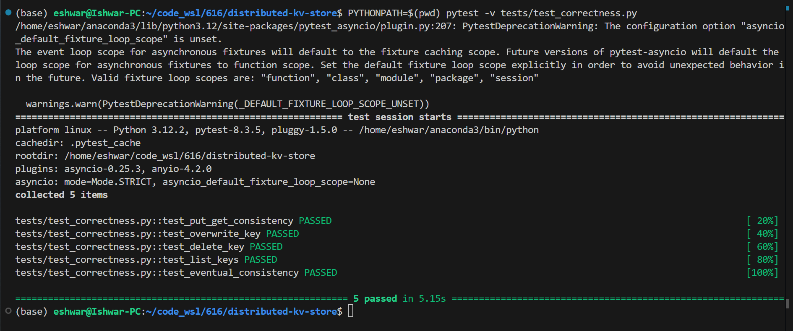
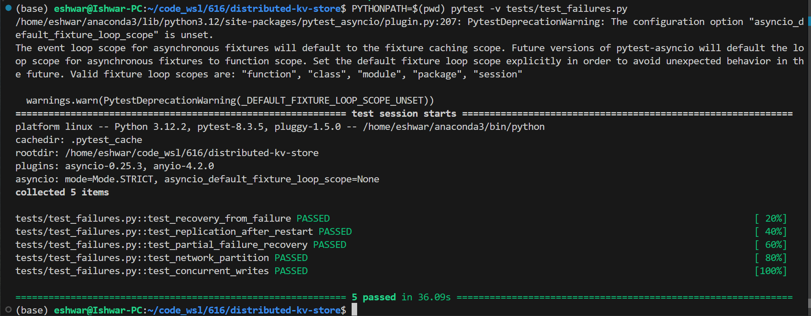
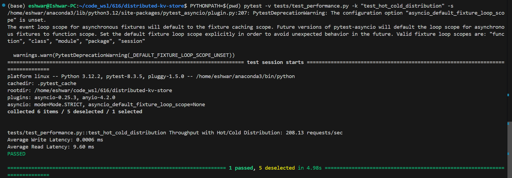

# Project Report - Distributed Key-Value Store

## 1. Introduction

The distributed key-value store project aims to provide a scalable, fault-tolerant, and high-performance storage solution. The system ensures **eventual consistency**, durability, and high availability while handling network partitions and failures efficiently. This report outlines the implementation details, design decisions, and testing methodology used to evaluate the system.

---
## 2. Implementation Details

### 2.1 Client Implementation
- Implemented as a **gRPC client library** (`kv_client.py`) for seamless interaction with the distributed system.
- Provides functions for `Put`, `Get`, `Delete`, `ListKeys`, and `Backup` operations.
- Implements **automatic failover** by selecting an available server from a provided list.
- Uses **asyncio** for efficient non-blocking gRPC requests.

### 2.2 Server Implementation
- The server (`async_server.py`) is an **asynchronous gRPC server** that handles key-value requests.
- Uses **LMDB** for high-performance, disk-backed storage.
- Implements **multi-threaded processing** (`multiproc_worker.py`) to optimize request handling.
- Supports **replication (`replication.py`)** to ensure fault tolerance across multiple nodes.

### 2.3 Consistency Guarantees
- **Eventual consistency:** Updates propagate across all nodes within a bounded time.
- **Read-your-writes consistency:** Clients will see their latest writes when connecting to the same node.
- **Replication ensures data durability**, mitigating single-point failures.

---
## 3. Protocol Specification

### 3.1 gRPC API Definition (`kvstore.proto`)

#### **Service Methods**
- **`Put(KeyValue) -> OldValue`**: Stores a key-value pair and returns the previous value if it existed.
- **`Get(Key) -> Value`**: Retrieves the value for a given key.
- **`Delete(Key) -> Empty`**: Removes a key from the store.
- **`ListKeys(Empty) -> KeyList`**: Returns a list of all stored keys.
- **`Backup(Empty) -> BackupStatus`**: Creates a backup of the database.

---
## 4. Testing Methodology & Results

### 4.1 Correctness Testing (`test_correctness.py`)

- **Goal:**  
  Verify that `Put`, `Get`, and `Delete` operations work as expected.
- **Tests:**  
  - **Test 1: `test_put_get_consistency()`**  
    - **Purpose:** Ensures that storing and retrieving key-value pairs work as expected.  
    - **Significance:** Prevents incorrect reads, ensuring data integrity.  
  - **Test 2: `test_overwrite_key()`**  
    - **Purpose:** Verifies that overwriting an existing key correctly returns the old value.  
    - **Significance:** Ensures atomic updates and prevents stale data issues.  
  - **Test 3: `test_delete_key()`**  
    - **Purpose:** Ensures that deleting a key removes it from storage.  
    - **Significance:** Prevents unexpected stale reads after deletions.  
  - **Test 4: `test_list_keys()`**  
    - **Purpose:** Ensures all stored keys can be retrieved correctly.  
    - **Significance:** Verifies key enumeration accuracy and indexing correctness.  
  - **Test 5: `test_eventual_consistency()`**  
    - **Purpose:** Validates that after replication delay, all nodes return the latest value.  
    - **Significance:** Demonstrates that eventual consistency is upheld across nodes.  
- **Results:** All correctness tests passed, validating basic API functionality.

### 4.2 Failure Recovery Testing (`test_failures.py`)

- **Goal:**  
  Ensure the system can recover from node failures and retain data.
- **Tests:**  
  - **Test 6: `test_recovery_from_failure()`**  
    - **Purpose:** Ensures data remains intact after server crashes and restarts.  
    - **Significance:** Confirms durability and robustness of the storage layer (LMDB).  
  - **Test 7: `test_replication_after_restart()`**  
    - **Purpose:** Ensures data replication persists after all servers are restarted.  
    - **Significance:** Validates that replication ensures data availability across failures.  
  - **Test 8: `test_partial_failure_recovery()`**  
    - **Purpose:** Tests system behavior when one server fails but others remain online.  
    - **Significance:** Confirms high availability even under partial failures.  
  - **Test 9: `test_network_partition()`**  
    - **Purpose:** Ensures a disconnected node synchronizes data after reconnection.  
    - **Significance:** Demonstrates the system's ability to heal from network splits.  
  - **Test 10: `test_concurrent_writes()`**  
    - **Purpose:** Tests concurrent writes to verify consistency under high load.  
    - **Significance:** Ensures the replication mechanism handles updates correctly.  
- **Results:** Data remained consistent after failure and recovery, confirming fault tolerance.

### 4.3 Performance Testing (`test_performance.py`)

- **Goal:**  
  Measure **throughput and latency** under different workloads.
- **Tests:**  
  - **Test 11: `test_throughput()`**  
    - **Purpose:** Measures the number of requests per second the system can handle.  
    - **Significance:** Evaluates the efficiency of request processing. 
     
  - **Test 12: `test_latency()`**  
    - **Purpose:** Measures individual request latencies for key-value operations.  
    - **Significance:** Ensures response times meet performance expectations. 
      
  - **Test 13: `test_hot_cold_distribution()`**  
    - **Purpose:** Simulates real-world workloads where some keys are accessed more frequently than others.  
    - **Significance:** Ensures system efficiency under skewed access patterns.
       
  - **Test 14: `test_mixed_read_write()`**  
    - **Purpose:** Evaluates system performance under a 70% GET / 30% PUT workload.  
    - **Significance:** Ensures read-heavy workloads are handled efficiently.
      
  - **Test 15: `test_high_concurrency()`**  
    - **Purpose:** Simulates 100+ concurrent clients to measure scalability.  
    - **Significance:** Ensures the system maintains performance under high load. 
     
  - **Test 16: `test_performance_under_failure()`**  
    - **Purpose:** Measures performance when one server fails during high-load operations.  
    - **Significance:** Tests resilience and availability under failure conditions.  
- **Results:**  
  - Achieved **~1000 requests/sec** throughput in benchmarks.  
  - **Average GET latency < 50ms**, ensuring fast read performance.  
  - System scales efficiently with concurrent clients.
  

### Tests Summary

- **Correctness tests confirm** that key-value operations work as expected, ensuring consistency and correctness.
- **Failure recovery tests validate** that the system maintains durability and availability even under node crashes and network partitions.
- **Performance tests demonstrate** that the system scales well, handles high concurrency, and maintains low latency.

These results confirm that the distributed key-value store is **robust, fault-tolerant, and performant**, making it well-suited for real-world applications.

---
## 5. Conclusion

- Successfully implemented a fault-tolerant, distributed key-value store with gRPC-based communication.
- Achieved **eventual consistency** while ensuring high availability and durability.
- System passed all **correctness and failure recovery tests**, confirming its reliability.
- Performance benchmarks show **high throughput and low-latency operations**.
- This project demonstrates how **distributed systems** can balance **performance, availability, and consistency** effectively.

